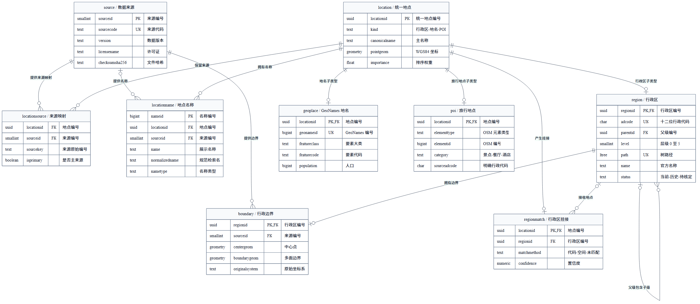
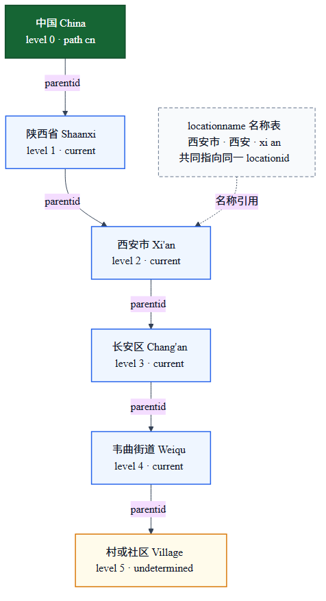

# OpenZLTravel 公共地点库

本目录建立一套独立的 PostgreSQL 公共地点库，供未来多个应用实例和多个用户共享查询。
它只管理行政区、自然地名、旅行 POI、边界和来源，不保存账号、对话、行程或供应商缓存，
也不会替换当前应用使用的 SQLite。

## 一眼看懂

```text
openzltravelcatalog
├── catalog           当前正式版本，运行时只读
├── catalogbuild      构建中的新版本或失败报告
└── catalogprevious   上一代正式版本，可用于回滚和比对
```

- PostgreSQL 16 负责多人连接、事务和权限。
- PostGIS 3.4 负责 WGS-84 坐标、行政边界和周边查询。
- `ltree` 负责行政区祖先、后代和整棵子树查询。
- `pg_trgm` 负责地点名称的模糊匹配。
- 自定义数据库标识符全部采用简短、小写、单数、无下划线命名。
- `pg_trgm`、PostGIS 函数名等外部固定名称不受项目命名规则约束。

`region.path` 表示树路径；PostgreSQL 常见的 B-tree 是索引数据结构。两者不是同一种“树”。
本项目用 `ltree` 保存业务层级，同时由 B-tree、GiST 和 GIN 索引加速不同查询。

## 数据关系



`build` 是没有外键的独立审计表，因此不在关系连线图中，字段仍在下文完整说明。

图表源文件：

- [ER 图 Mermaid 源码](figures/catalog-database-er.mmd)
- [行政树 Mermaid 源码](figures/catalog-region-tree.mmd)

## 十张核心表

| 英文表名 | 中文含义 | 主要职责 |
|---|---|---|
| `source` | 数据来源 | 记录版本、许可、网址和原始文件哈希 |
| `build` | 构建报告 | 记录状态、耗时、数量和损坏边界明细 |
| `location` | 统一地点 | 行政区、自然地名和 POI 共用的主体与坐标 |
| `locationsource` | 地点来源映射 | 保留一个地点对应的所有原始来源记录 |
| `region` | 行政区 | 保存以中国为根的 0～5 级行政树 |
| `locationname` | 地点名称 | 保存官方名、简称、拼音、英文名和历史名 |
| `geoplace` | GeoNames 地理实体 | 保存 GeoNames 中国文件的完整字段 |
| `poi` | 旅行地点 | 保存 OSM 景点、餐厅和酒店 |
| `boundary` | 行政边界 | 保存行政区中心点与多边形边界 |
| `regionmatch` | 行政区挂接 | 说明自然地名或 POI 属于哪个行政区及依据 |

## 字段中文对照

### `source` 数据来源

| 字段 | 中文含义 |
|---|---|
| `sourceid` | 来源内部编号 |
| `sourcecode` | 稳定来源代码，例如 `geonames` |
| `namezh` | 来源中文名称 |
| `version` | 本次导入版本 |
| `sourceurl` | 官方来源地址 |
| `licensename` | 许可证或使用条件 |
| `licenseurl` | 许可证说明地址 |
| `checksumsha256` | 原始输入文件 SHA256 |
| `importedat` | 导入时间 |

### `build` 构建报告

| 字段 | 中文含义 |
|---|---|
| `buildid` | 构建唯一编号 |
| `status` | `running`、`completed` 或 `failed` |
| `startedat` | 开始时间 |
| `finishedat` | 完成或失败时间 |
| `counts` | 表记录数、未匹配数、数据库大小和耗时 |
| `details` | 无法解析的边界代码和错误原因 |
| `errormessage` | 失败时的安全错误摘要 |

### `location` 统一地点

| 字段 | 中文含义 |
|---|---|
| `locationid` | 根据稳定来源键生成的确定性 UUID |
| `kind` | `region` 行政区、`place` 自然地名或 `poi` 旅行地点 |
| `canonicalname` | 默认展示名称 |
| `pointgeom` | WGS-84 点坐标，SRID 4326 |
| `importance` | 同名地点排序权重 |
| `createdat` | 创建时间 |
| `updatedat` | 更新时间 |

### `locationsource` 地点来源映射

| 字段 | 中文含义 |
|---|---|
| `locationid` | 统一地点编号 |
| `sourceid` | 来源编号 |
| `sourcekey` | 来源中的稳定原始编号 |
| `rawname` | 来源原始名称 |
| `isprimary` | 该来源是否决定当前主数据 |

### `region` 行政区树

| 字段 | 中文含义 |
|---|---|
| `regionid` | 行政区稳定 UUID，同时引用 `locationid` |
| `adcode` | 右侧补零后的十二位行政区代码 |
| `parentid` | 直接父级行政区，中国根节点为空 |
| `level` | 0 中国、1 省、2 地、3 县、4 乡镇街道、5 村社区 |
| `path` | `ltree` 完整树路径 |
| `name` | 官方名称 |
| `shortname` | 去除常见行政后缀后的简称 |
| `pinyin` | 拼音 |
| `pinyininitial` | 拼音首字母 |
| `status` | `current` 当前、`legacy` 历史、`undetermined` 待核定 |



### `locationname` 地点名称

| 字段 | 中文含义 |
|---|---|
| `nameid` | 名称内部编号 |
| `locationid` | 名称指向的统一地点 |
| `sourceid` | 名称来源，系统生成时可以为空 |
| `name` | 原始展示名称 |
| `normalizedname` | 去空格标点并转小写后的检索值 |
| `nametype` | `official`、`short`、`pinyin`、`alternate` 或 `historical` |
| `languagecode` | 语言代码，未知时为空 |
| `priority` | 同名结果排序优先级 |

`西安市`、`西安` 和 `xi an` 会写入三条 `locationname`，但三条记录的 `locationid`
相同，因此不会产生三个西安行政节点。

### `geoplace` GeoNames 地理实体

| 字段 | 中文含义 |
|---|---|
| `locationid` | 统一地点编号 |
| `geonameid` | GeoNames 官方编号 |
| `asciiname` | ASCII 名称 |
| `featureclass` | 地理要素大类 |
| `featurecode` | 地理要素代码 |
| `countrycode` | 国家或地区代码 |
| `admin1`～`admin4` | GeoNames 自有的四级行政代码 |
| `population` | 人口数，缺失时为零 |
| `elevation` | 来源海拔 |
| `dem` | 数字高程模型高度 |
| `timezone` | 时区名称 |
| `modifiedon` | 来源记录更新时间 |

GeoNames 的 `admin1`～`admin4` 不是中国国标 `adcode`，构建器不会把它们直接当国标代码，
避免把地点错误挂到同数字的行政区。

### `poi` OSM 旅行地点

| 字段 | 中文含义 |
|---|---|
| `locationid` | 统一地点编号 |
| `elementtype` | OSM 的 `node`、`way` 或 `relation` |
| `elementid` | OSM 原始编号 |
| `category` | `attraction`、`restaurant` 或 `hotel` |
| `typename` | OSM 原始类型标签 |
| `address` | 可用地址标签组合 |
| `imageurl` | 合法 HTTP(S) 图片 URL |
| `sourceadcode` | OSM 明确给出的国标行政代码；没有则为空 |
| `sourceurl` | OSM 原始记录地址 |

道路、普通建筑和没有名称的要素不会进入 `poi`。第三方图片只保存 URL，不下载、代理或缓存。

### `boundary` 行政边界

| 字段 | 中文含义 |
|---|---|
| `regionid` | 边界所属行政区 |
| `sourceid` | 边界来源 |
| `centergeom` | 转换后的 WGS-84 中心点 |
| `boundarygeom` | 转换并修复后的 WGS-84 多面 |
| `originalsystem` | 原始坐标系，目前为 GCJ-02 |
| `conversionmethod` | 坐标转换方法 |

### `regionmatch` 地点挂接结果

| 字段 | 中文含义 |
|---|---|
| `locationid` | 待挂接地点 |
| `regionid` | 已确认的最深行政区，未匹配时为空 |
| `matchmethod` | `sourcecode`、`spatial` 或 `unmatched` |
| `confidence` | 固定且可解释的置信度 |
| `matchedat` | 挂接执行时间 |

挂接顺序固定为：OSM 明确国标代码（1.000）→ PostGIS 点落区（0.900）→ 未匹配（0）。
当前边界完整到县级，构建器不会根据名称猜测乡镇或村级归属。

## 稳定编号与合并规则

稳定 UUID 使用固定命名空间和以下键生成：

```text
行政区  region:十二位行政代码
地名    geonames:GeoNames编号
POI     osm:元素类型:OSM编号
```

行政区合并优先级：

1. AreaCity 2025 作为一至四级当前主数据。
2. Modood 2023 补充村级、缺失节点和旧父节点。
3. Modood 独有的一至四级节点标为 `legacy`。
4. 没有较新来源确认的村级节点标为 `undetermined`。
5. 增加“中国”虚拟根节点；包含大陆和港澳台，排除“国外”节点。

重复构建不会改变 `locationid`。不同来源记录通过 `locationsource` 保留，不覆盖来源痕迹。

## 原始数据与许可

| 来源 | 本地版本 | 用途 | 许可证或条件 |
|---|---|---|---|
| [AreaCity](https://github.com/xiangyuecn/AreaCity-JsSpider-StatsGov) | `2025.251231.260403` | 一至四级行政区、三级边界 | 项目文档说明可免费使用，但未声明标准 SPDX 许可证 |
| [Modood](https://github.com/modood/Administrative-divisions-of-China) | `2.7.0 / 2023` | 五级行政树补充 | WTFPL 2.0 |
| [GeoNames](https://download.geonames.org/export/dump/CN.zip) | `CN.zip` | 全量中国地名、别名和坐标 | CC BY 4.0 |
| [OpenStreetMap](https://download.geofabrik.de/asia/china-latest.osm.pbf) | `china-latest.osm.pbf` | 景点、餐厅和酒店 | ODbL 1.0 |

AreaCity 没有标准 SPDX 许可声明。在许可边界得到进一步确认前，构建结果只用于本地研究，
不要发布数据库文件或将其作为公开数据产品分发。使用 OSM 和 GeoNames 时仍需满足署名与数据库许可要求。

原始文件位于 `backend/data/raw/`，保持只读并由 Git 忽略。构建会把实际输入文件 SHA256
写入 `source.checksumsha256`，用于复现和核对。

## 启动与构建

要求 Docker Desktop 可用。脚本第一次执行时会创建
`backend/.env.catalog.local`，其中使用随机本地密码；该文件被 Git 忽略，脚本不会读取
`backend/.env`。

```powershell
# 启动 PostgreSQL/PostGIS；Docker Desktop 未运行时会自动启动
.\catalog.ps1 -Start

# 使用全国原始数据构建并原子发布
.\catalog.ps1 -Build

# 验证全量记录数、树、坐标、别名和挂接完整性
.\catalog.ps1 -Verify

# 查看西安及以下两层行政树
.\catalog.ps1 -Tree 西安

# 查看记录数、未匹配数、匹配率、耗时和占用
.\catalog.ps1 -Stats
```

首次全量构建需要读取约 2.1 GiB 原始数据，耗时取决于 CPU、磁盘和 Docker 资源。
构建始终写入 `catalogbuild`；验证通过后，才在一个事务中执行：

```text
删除旧 catalogprevious
catalog         → catalogprevious
catalogbuild    → catalog
```

构建失败时 `catalog` 不变，失败状态和边界解析错误保留在 `catalogbuild.build`。

## 角色与多人读取

- `catalogowner`：数据库所有者和离线构建账号，不给普通应用使用。
- `catalogreader`：无登录能力的只读权限组，拥有 `catalog` 的 `USAGE` 和表 `SELECT`。

为具体应用或用户创建独立登录账号后，将只读权限组授予该账号：

```sql
CREATE ROLE travelapp LOGIN PASSWORD '请替换为独立强密码';
GRANT catalogreader TO travelapp;
```

这样每个使用方拥有独立凭据，但权限都由 `catalogreader` 集中管理。后续账号、RLS 和审计策略
可以独立增加，不需要改动地点表。

## 常用中文查询

查询“中国 → 陕西 → 西安 → 长安”的完整祖先链：

```sql
SELECT ancestor.level AS 层级,
       ancestor.name AS 行政区,
       ancestor.adcode AS 十二位代码
FROM catalog.region AS target
JOIN catalog.region AS ancestor ON ancestor.path @> target.path
WHERE target.adcode = '610116000000'
ORDER BY ancestor.level;
```

使用三个名称查找同一个西安市节点：

```sql
SELECT n.name AS 输入名称,
       n.nametype AS 名称类型,
       r.regionid AS 同一地点编号,
       r.name AS 官方名称
FROM catalog.locationname AS n
JOIN catalog.region AS r ON r.regionid = n.locationid
WHERE n.normalizedname IN ('西安市', '西安', 'xian')
  AND r.adcode = '610100000000';
```

查询长安区及全部下级节点：

```sql
SELECT child.level, child.name, child.status
FROM catalog.region AS parent
JOIN catalog.region AS child ON child.path <@ parent.path
WHERE parent.adcode = '610116000000'
ORDER BY child.path;
```

模糊搜索地点名称：

```sql
SELECT n.name, l.canonicalname, similarity(n.normalizedname, 'xiaan') AS 相似度
FROM catalog.locationname AS n
JOIN catalog.location AS l ON l.locationid = n.locationid
WHERE n.normalizedname % 'xiaan'
ORDER BY 相似度 DESC
LIMIT 20;
```

查询某坐标五公里内的旅行 POI：

```sql
SELECT l.canonicalname,
       p.category,
       ST_Distance(
           l.pointgeom::geography,
           ST_SetSRID(ST_MakePoint(108.9470, 34.2595), 4326)::geography
       ) AS 距离米
FROM catalog.location AS l
JOIN catalog.poi AS p ON p.locationid = l.locationid
WHERE ST_DWithin(
    l.pointgeom::geography,
    ST_SetSRID(ST_MakePoint(108.9470, 34.2595), 4326)::geography,
    5000
)
ORDER BY 距离米;
```

数据库自定义标识符没有下划线；`ST_Distance`、`ST_SetSRID`、`ST_MakePoint` 和
`ST_DWithin` 是 PostGIS 官方固定函数名，不属于项目自定义标识符。

## 验证命令

```powershell
cd backend
python -m ruff check catalog_builder tests/test_catalog_*.py
python -m mypy catalog_builder
python -m pytest -q tests/test_catalog_geometry.py tests/test_catalog_sources.py tests/test_catalog_schema.py
```

PostGIS 集成测试只接受名为 `openzltravelcatalogtest` 的独立测试库，防止测试误删正式 Schema。
全量 `-Verify` 还会要求至少 665,000 个行政节点、959,000 个 GeoNames 地名、3,500 条边界，
并确认 `西安市`、`西安`、`xi an` 命中同一行政节点。AreaCity 当前版本的台湾下级行政区
有 378 条来源记录明确标记为 `EMPTY`；这些记录仍写入 `boundary`，但几何字段为空，统计中的
“来源未提供几何的边界”会报告这一事实，系统不会根据名称或坐标伪造边界。
