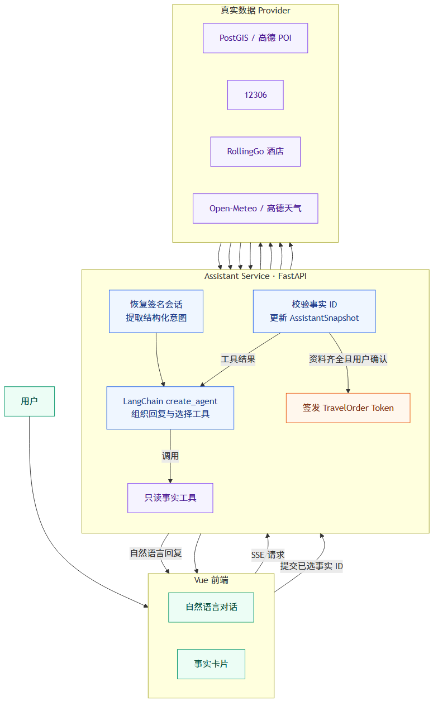
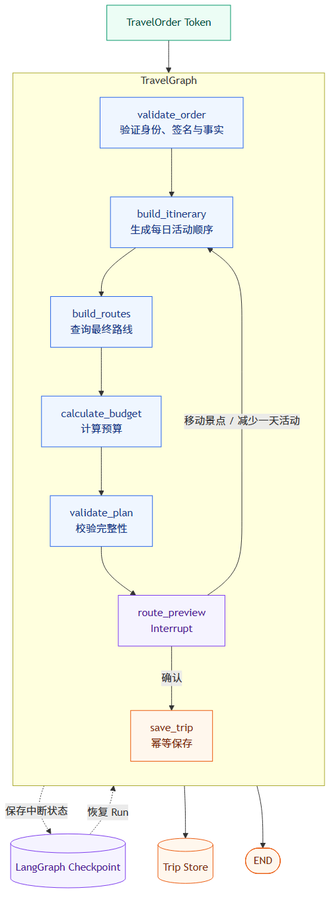

# OpenZLTravel


> [!IMPORTANT]
> 这个项目是我用来学习 LangChain 和 LangGraph 所创建。项目把自然语言交流、工具调用、结构化工单、状态图、检查点和中断恢复串成一个完整的旅行规划流程，方便从真实代码中理解两个框架各自负责什么，以及它们如何协作。

OpenZLTravel 是一个 AI 旅行助手。用户先和 Assistant 聊清楚出发地、目的地、日期、预算与偏好，再把经过校验的旅行工单交给 TravelGraph 生成行程。


## 功能

- 使用自然语言收集和修改旅行需求。
- 查询景点、12306 车次、酒店与天气，并保留未知或暂不可查的状态。
- 通过卡片选择真实事实，确认后签发不可篡改的旅行工单。
- 使用 LangGraph 生成日程、路线和预算，在确认后保存最终行程。

## LangChain 架构

LangChain 负责交流、调用只读工具、维护签名会话快照，以及生成交给规划图的工单。



[查看 Mermaid 图源](figures/langchain-assistant-architecture.mmd)

## LangGraph 架构

TravelGraph 只接收 Assistant 签发的 `TravelOrder Token`，按固定节点执行规划。`route_preview` 是唯一中断点，用户可以确认结果或提交受限修改。



[查看 Mermaid 图源](figures/langgraph-planning-architecture.mmd)

## 代码结构

```text
backend/src/
  assistant/        LangChain 对话、事实工具、会话与工单交接
  travel_graph/     LangGraph 状态、节点、中断、Checkpoint 与保存
  domain/           领域模型、规划算法和事实校验
  infrastructure/   POI、12306、酒店、天气与路线 Provider
  runtime/          配置、依赖装配、身份与签名 Token

frontend/src/features/
  assistant/        对话、事实卡片与 SSE
  planning/         Graph Run、路线确认与行程展示
  trips/            历史行程
```

更详细的职责边界见 [ARCHITECTURE.md](ARCHITECTURE.md)，完整调用流程见 [CODE_FLOW.md](docs/CODE_FLOW.md)。

## 地点数据

地点目录体积较大，不直接存放在 Git 仓库中。可从 [Google Drive 下载 2026-08-28 备份](https://drive.google.com/file/d/1bfyU_XFjQcnFIaAehMtYXhZZdvu1RdXQ/view?usp=drive_link)。

- 下载包：`openzltravel-backups.zip`
- 数据库归档：PostgreSQL Custom Format + Zstandard，解压后 346.67 MiB
- SHA256：`3935F6AD76B2210DB91D33CCF643983426814C3EE3A0323C55FC00185A6332A0`
- 内容：公开地点、行政区划、POI、边界与多语言地名
- 不包含：账号密码、Assistant 会话、LangGraph Checkpoint 和历史行程

下载后按 [恢复说明](docs/data/RESTORE.md) 导入，数据规模、来源和许可证见 [数据清单](docs/data/catalog-20260828.json)。

## 快速启动

需要安装 Docker Desktop。先复制本地配置文件并填写其中的模型、Provider 与数据库配置：

```powershell
Copy-Item backend/.env.example backend/.env
Copy-Item backend/.env.catalog.example backend/.env.catalog.local
```

启动四个服务：

```powershell
.\start.ps1 up
```

访问 [http://127.0.0.1:5173](http://127.0.0.1:5173)。

| 服务 | 端口 | 职责 |
|---|---:|---|
| `frontend` | 5173 | Vue 页面与两个后端的请求代理 |
| `assistant` | 2030 | LangChain 对话、工具和工单 |
| `agent` | 2024 | LangGraph 规划与历史行程接口 |
| `catalogdb` | 55432 | PostGIS 地点目录 |

## 验证

```powershell
cd backend
python -m ruff check src tests catalog_builder benchmarks
python -m mypy
python -m pytest -q

cd ../frontend
npm.cmd test
npm.cmd run build
```

## 灵感来源

- [tutu-zzz/zhilv-yuntu](https://github.com/tutu-zzz/zhilv-yuntu)
- [Reyzowter/Hello-Agents](https://github.com/Reyzowter/Hello-Agents)
