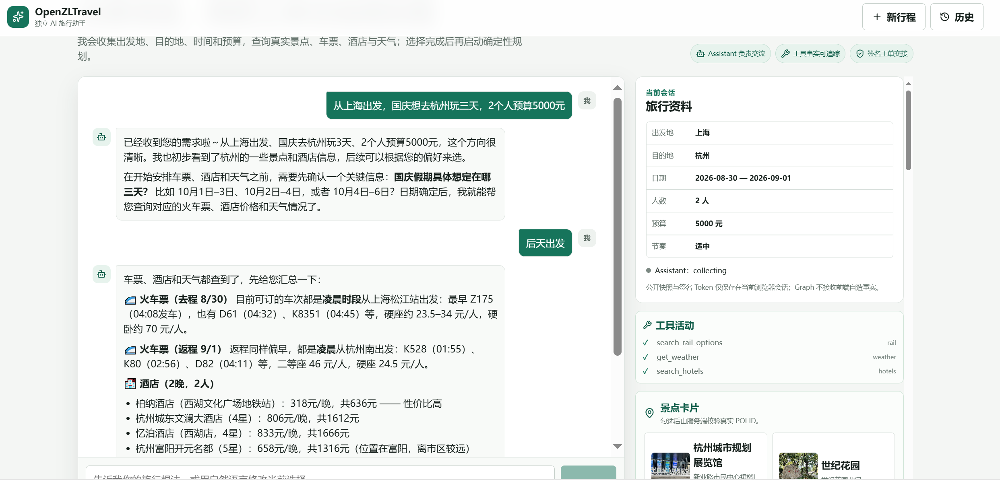
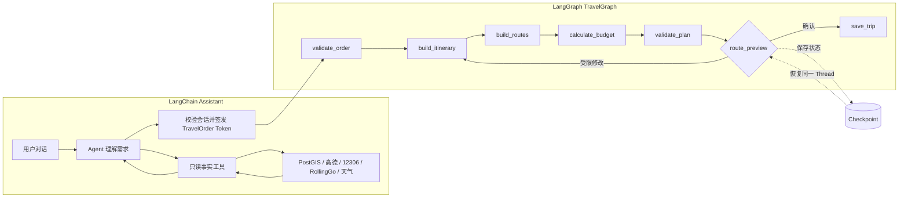
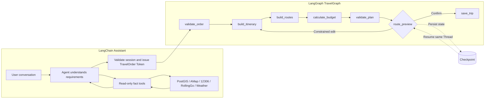

# OpenZLTravel


[中文](#中文) | [English](#english)



## 中文

> [!IMPORTANT]
> 这个项目是我用来学习 LangChain 和 LangGraph 所创建。它不是一组孤立示例，而是一条可以运行的旅行规划链路：Assistant 通过自然语言收集需求和查询事实，签发结构化工单，再由 TravelGraph 按固定状态图生成、确认并保存行程。

### 项目做什么

OpenZLTravel 是一个面向单目的地旅行的 AI 助手。用户不需要填写复杂表单，只需在对话中说明出发地、目的地、日期、预算和偏好。

- 使用 LangChain Agent 进行多轮交流，并调用只读事实工具。
- 查询本地 PostGIS 地点目录、高德地点与路线、12306 车次、RollingGo 酒店和天气。
- 所有城市、景点、车次和酒店选择都通过服务端事实 ID 校验。
- 交流完成后签发短时 `TravelOrder Token`，明确交给 LangGraph，而不是只停留在聊天结果。
- 使用 LangGraph 生成日程、路线和预算，在唯一中断点确认后保存行程。
- 保留未知价格、库存和天气状态，不让模型用猜测填补上游缺失。

### LangChain 与 LangGraph 流程

LangChain 负责交流、事实查询和工单签发；LangGraph 只接收已签名工单，并按固定节点完成规划。



TravelGraph 只接受 `{"order_token":"..."}`，不读取 Assistant 聊天记录。`route_preview` 是唯一中断点。Checkpoint 用于在同一 Thread 上恢复状态；它不会自动修复 Provider 故障、无效事实或业务校验错误。

### 职责边界

| 模块 | 负责 | 不负责 |
|---|---|---|
| `assistant/` | 对话、工具、事实选择、会话和工单交接 | 运行规划图、保存最终行程 |
| `travel_graph/` | 工单验证、规划、路线、预算、中断和保存 | 收集需求、发现候选事实 |
| `domain/` | 领域模型、确定性规划和事实校验 | 网络请求、环境配置、图路由 |
| `infrastructure/` | 地点、铁路、酒店、天气和路线 Provider | 控制 Agent 或 Graph 流程 |
| `runtime/` | 配置、依赖装配、身份和签名 Token | 承载业务状态 |
| `frontend/` | Assistant、Planning 和 Trips 三块界面 | 解析自然语言、制造事实 |

```text
backend/src/
  assistant/        LangChain 对话、事实工具、会话与工单交接
  travel_graph/     LangGraph 状态、节点、中断、Checkpoint 与保存
  domain/           领域模型、规划算法和事实校验
  infrastructure/   POI、12306、酒店、天气与路线 Provider
  runtime/          配置、依赖装配、身份与签名 Token

frontend/src/features/
  assistant/        对话、事实卡片与 SSE
  planning/         Graph Run、路线确认与行程展示
  trips/            历史行程
```

详细边界见 [ARCHITECTURE.md](ARCHITECTURE.md)，完整调用顺序见 [CODE_FLOW.md](docs/CODE_FLOW.md)。

### 快速启动

需要 Python 3.11、Node.js 和 Docker Desktop。先创建本地配置：

```powershell
Copy-Item backend/.env.example backend/.env
Copy-Item backend/.env.catalog.example backend/.env.catalog.local
```

填写模型、Provider 和数据库配置后启动四个服务：

```powershell
.\start.ps1 up
```

访问 [http://127.0.0.1:5173](http://127.0.0.1:5173)。

| 服务 | 端口 | 职责 |
|---|---:|---|
| `frontend` | 5173 | Vue 页面与两个后端的请求代理 |
| `assistant` | 2030 | LangChain 对话、工具和工单 |
| `agent` | 2024 | LangGraph 规划与历史行程接口 |
| `catalogdb` | 55432 | PostGIS 地点目录 |

### 地点数据

地点目录体积较大，不直接存放在 Git 仓库中。可从 [Google Drive 下载 2026-08-28 备份](https://drive.google.com/file/d/1bfyU_XFjQcnFIaAehMtYXhZZdvu1RdXQ/view?usp=drive_link)。

- 下载包：`openzltravel-backups.zip`
- 数据库归档：PostgreSQL Custom Format + Zstandard，解压后 346.67 MiB
- SHA256：`3935F6AD76B2210DB91D33CCF643983426814C3EE3A0323C55FC00185A6332A0`
- 包含：公开地点、行政区划、POI、边界与多语言地名
- 不包含：账号密码、Assistant 会话、LangGraph Checkpoint 和历史行程

下载后按 [恢复说明](docs/data/RESTORE.md) 导入。数据规模、来源和许可证见 [数据清单](docs/data/catalog-20260828.json)。

### 验证

```powershell
cd backend
python -m ruff check src tests catalog_builder
python -m mypy
python -m pytest -q

cd ../frontend
npm.cmd test
npm.cmd run build

cd ..
docker compose --env-file backend/.env --env-file backend/.env.catalog.local config
```

### 许可与署名

#### 项目代码

本仓库目前没有根级 `LICENSE` 文件，因此尚未声明项目代码的开源许可证。在维护者选择并加入正式许可证前，本仓库的公开可见性不代表自动授予复制、修改或再分发代码的权利。

#### 地点数据

公开地点备份聚合了多个上游数据源。使用或再分发备份时，必须保留 [完整数据清单](docs/data/catalog-20260828.json) 及下列署名：

| 数据源 | 用途 | 许可证或使用条款 |
|---|---|---|
| [OpenStreetMap](https://www.openstreetmap.org/copyright) | 中国 POI 与地理要素 | [ODbL 1.0](https://opendatacommons.org/licenses/odbl/1-0/) |
| [GeoNames](https://www.geonames.org/) | 中国地名与多语言名称 | [CC BY 4.0](https://creativecommons.org/licenses/by/4.0/) |
| [Modood Administrative Divisions of China](https://github.com/modood/Administrative-divisions-of-China) | 中国五级行政区划 | [WTFPL 2.0](https://github.com/modood/Administrative-divisions-of-China/blob/master/LICENSE) |
| [AreaCity](https://github.com/xiangyuecn/AreaCity-JsSpider-StatsGov) | 行政区划和边界 | 上游项目说明允许免费使用，但未声明标准 SPDX 许可证；使用前应核对其最新说明 |

高德开放平台、12306、Open-Meteo 和 RollingGo 只在运行时提供查询结果，不包含在地点备份中。部署者需要自行申请所需凭证，并遵守各服务的最新条款、配额和署名要求。所有第三方名称和商标归其各自所有者所有。

---

## English

> [!IMPORTANT]
> I created this project to explore LangChain and LangGraph through a complete, runnable travel-planning workflow rather than isolated examples. The Assistant gathers requirements and verified facts, issues a structured order, and hands it to TravelGraph for deterministic planning, review, and persistence.

### What It Does

OpenZLTravel is an AI assistant for single-destination trips. Instead of filling in a long form, users describe their origin, destination, dates, budget, and preferences in a conversation.

- Uses a LangChain Agent for multi-turn conversation and read-only tool calls.
- Queries a local PostGIS catalog, AMap places and routes, China Railway 12306 trains, RollingGo hotels, and weather providers.
- Validates every selected city, POI, train, and hotel against server-side fact IDs.
- Refreshes time-sensitive facts and issues a short-lived `TravelOrder Token` before handing control to LangGraph.
- Uses LangGraph to build the itinerary, routes, and budget, then saves the trip after review.
- Preserves unknown prices, inventory, and weather instead of asking the model to invent missing upstream data.

### LangChain and LangGraph Flow

LangChain owns conversation, fact retrieval, and order issuance. LangGraph accepts only the signed order and executes a fixed planning path.



TravelGraph accepts only `{"order_token":"..."}` and never reads the Assistant conversation. `route_preview` is the only interrupt. Checkpoints restore state on the same Thread; they do not automatically repair provider outages, invalid facts, or business-validation failures.

### Responsibility Boundaries

| Module | Owns | Does not own |
|---|---|---|
| `assistant/` | Conversation, tools, fact selection, sessions, and handoff | Graph execution or final-trip persistence |
| `travel_graph/` | Order validation, planning, routes, budget, interrupt, and persistence | Requirement collection or candidate discovery |
| `domain/` | Domain models, deterministic planning, and fact validation | Networking, environment configuration, or graph routing |
| `infrastructure/` | Place, rail, hotel, weather, and route providers | Agent or Graph control flow |
| `runtime/` | Configuration, dependency wiring, identity, and signed tokens | Business state |
| `frontend/` | Assistant, Planning, and Trips interfaces | Natural-language parsing or fact creation |

```text
backend/src/
  assistant/        LangChain conversation, facts, sessions, and handoff
  travel_graph/     LangGraph state, nodes, interrupt, checkpoints, and persistence
  domain/           Domain models, planning algorithms, and validation
  infrastructure/   POI, China Railway, hotel, weather, and route providers
  runtime/          Configuration, dependency wiring, identity, and signed tokens

frontend/src/features/
  assistant/        Conversation, fact cards, and SSE
  planning/         Graph runs, route review, and itinerary display
  trips/            Saved trips
```

See [ARCHITECTURE.md](ARCHITECTURE.md) for detailed boundaries and [CODE_FLOW.md](docs/CODE_FLOW.md) for the full call sequence.

### Quick Start

Python 3.11, Node.js, and Docker Desktop are required. Create the local configuration files first:

```powershell
Copy-Item backend/.env.example backend/.env
Copy-Item backend/.env.catalog.example backend/.env.catalog.local
```

Fill in the model, provider, and database settings, then start all four services:

```powershell
.\start.ps1 up
```

Open [http://127.0.0.1:5173](http://127.0.0.1:5173).

| Service | Port | Responsibility |
|---|---:|---|
| `frontend` | 5173 | Vue UI and proxies for both backend services |
| `assistant` | 2030 | LangChain conversation, tools, and order issuance |
| `agent` | 2024 | LangGraph planning and saved-trip APIs |
| `catalogdb` | 55432 | PostGIS place catalog |

### Place Data

The place catalog is too large for the Git repository. Download the [2026-08-28 backup from Google Drive](https://drive.google.com/file/d/1bfyU_XFjQcnFIaAehMtYXhZZdvu1RdXQ/view?usp=drive_link).

- Package: `openzltravel-backups.zip`
- Database archive: PostgreSQL Custom Format + Zstandard, 346.67 MiB after extraction
- SHA256: `3935F6AD76B2210DB91D33CCF643983426814C3EE3A0323C55FC00185A6332A0`
- Includes: public places, administrative divisions, POIs, boundaries, and multilingual names
- Excludes: credentials, Assistant sessions, LangGraph checkpoints, and saved trips

Follow the [restore guide](docs/data/RESTORE.md) after downloading. See the [data manifest](docs/data/catalog-20260828.json) for record counts, sources, and licenses.

### Verification

```powershell
cd backend
python -m ruff check src tests catalog_builder
python -m mypy
python -m pytest -q

cd ../frontend
npm.cmd test
npm.cmd run build

cd ..
docker compose --env-file backend/.env --env-file backend/.env.catalog.local config
```

### License and Attribution

#### Project Code

This repository currently has no root-level `LICENSE` file, so no open-source license has been declared for the project code. Public visibility does not by itself grant permission to copy, modify, or redistribute the code until the maintainer adds an explicit license.

#### Place Data

The public place backup combines several upstream datasets. Keep the [complete data manifest](docs/data/catalog-20260828.json) and the following attribution when using or redistributing it:

| Source | Use | License or terms |
|---|---|---|
| [OpenStreetMap](https://www.openstreetmap.org/copyright) | Chinese POIs and geographic features | [ODbL 1.0](https://opendatacommons.org/licenses/odbl/1-0/) |
| [GeoNames](https://www.geonames.org/) | Chinese place names and multilingual names | [CC BY 4.0](https://creativecommons.org/licenses/by/4.0/) |
| [Modood Administrative Divisions of China](https://github.com/modood/Administrative-divisions-of-China) | Five-level Chinese administrative divisions | [WTFPL 2.0](https://github.com/modood/Administrative-divisions-of-China/blob/master/LICENSE) |
| [AreaCity](https://github.com/xiangyuecn/AreaCity-JsSpider-StatsGov) | Administrative divisions and boundaries | The upstream project permits free use but does not declare a standard SPDX license; review its latest terms before use |

AMap, China Railway 12306, Open-Meteo, and RollingGo provide runtime query results and are not bundled into the place backup. Deployers must obtain any required credentials and comply with each provider's current terms, quotas, and attribution requirements. All third-party names and trademarks belong to their respective owners.

## 灵感来源 / Inspiration

- [tutu-zzz/zhilv-yuntu](https://github.com/tutu-zzz/zhilv-yuntu)
- [Reyzowter/Hello-Agents](https://github.com/Reyzowter/Hello-Agents)
