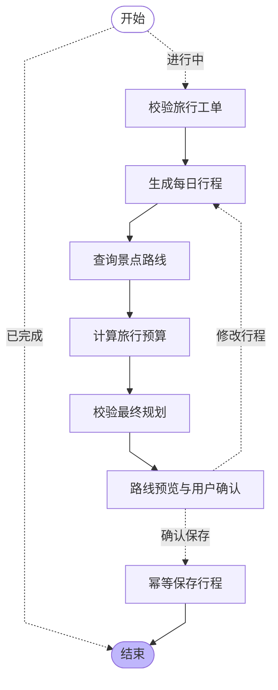

# OpenZLTravel 后端工作流

```mermaid
---
config:
  flowchart:
    curve: linear
---
graph TD;
	__start__(["开始"]):::first
	validate_order["校验旅行工单"]
	build_itinerary["生成每日行程"]
	build_routes["查询景点路线"]
	calculate_budget["计算旅行预算"]
	validate_plan["校验最终规划"]
	route_preview["路线预览与用户确认"]
	save_trip["幂等保存行程"]
	__end__(["结束"]):::last
	__start__ -. 已完成 .-> __end__;
	__start__ -. 进行中 .-> validate_order;
	build_itinerary --> build_routes;
	build_routes --> calculate_budget;
	calculate_budget --> validate_plan;
	route_preview -. 修改行程 .-> build_itinerary;
	route_preview -. 确认保存 .-> save_trip;
	validate_order --> build_itinerary;
	validate_plan --> route_preview;
	save_trip --> __end__;
	classDef default fill:#f2f0ff,line-height:1.2
	classDef first fill-opacity:0
	classDef last fill:#bfb6fc

```
