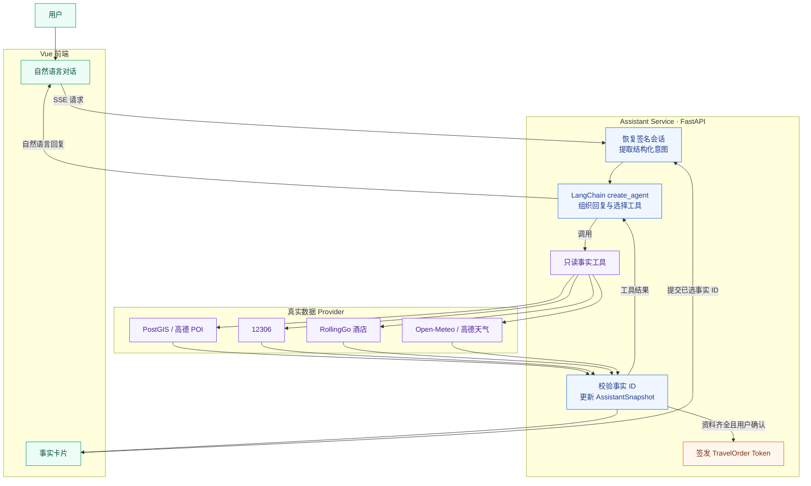

# LangChain Assistant Architecture

Assistant 对话、只读工具、签名快照与工单交接架构。

```mermaid
flowchart TB
    user["用户"]

    subgraph frontend["Vue 前端"]
        direction LR
        chat["自然语言对话"]
        cards["事实卡片"]
    end

    subgraph assistant["Assistant Service · FastAPI"]
        direction TB
        turn["恢复签名会话<br/>提取结构化意图"]
        agent["LangChain create_agent<br/>组织回复与选择工具"]
        tools["只读事实工具"]
        snapshot["校验事实 ID<br/>更新 AssistantSnapshot"]
        handoff["签发 TravelOrder Token"]

        turn --> agent
        agent -->|"调用"| tools
        snapshot -->|"工具结果"| agent
        snapshot -->|"资料齐全且用户确认"| handoff
    end

    subgraph providers["真实数据 Provider"]
        direction LR
        catalog["PostGIS / 高德 POI"]
        rail["12306"]
        hotel["RollingGo 酒店"]
        weather["Open-Meteo / 高德天气"]
    end

    user --> chat
    chat -->|"SSE 请求"| turn
    agent -->|"自然语言回复"| chat
    tools --> catalog
    tools --> rail
    tools --> hotel
    tools --> weather
    catalog --> snapshot
    rail --> snapshot
    hotel --> snapshot
    weather --> snapshot
    snapshot --> cards
    cards -->|"提交已选事实 ID"| turn

    classDef input fill:#ECFDF5,stroke:#059669,color:#064E3B;
    classDef service fill:#EFF6FF,stroke:#2563EB,color:#1E3A8A;
    classDef tool fill:#F5F3FF,stroke:#7C3AED,color:#4C1D95;
    classDef output fill:#FFF7ED,stroke:#EA580C,color:#7C2D12;
    class user,chat,cards input;
    class turn,agent,snapshot service;
    class tools,catalog,rail,hotel,weather tool;
    class handoff output;
```
